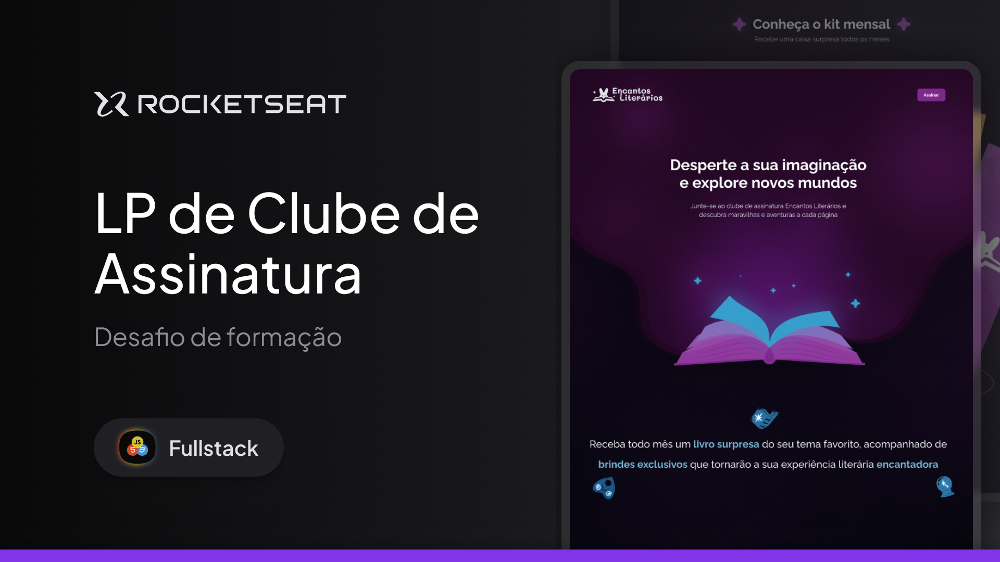

# Desafio prático - LP clube de assinatura

<picture>
  <source media="(prefers-color-scheme: dark)" srcset="assets/images/Thumbnail-md.png">
  <source media="(prefers-color-scheme: light)" srcset="assets/images/Thumbnail-md.png">
  
</picture>

### Conceitos trabalhados nessa aplicação:

|Conceitos                              |     |
|---------------------------------------|---------------------------------------|
|  ✔ CSS Animations                   | ✔ CSS Transitions   |
|  ✔ Responsividade (80% Concluído)   | ✔ CSS Functions |
